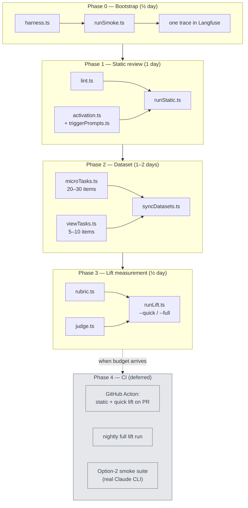

# Eval suite plan for `vaadin-playwright-test`

This document is the durable reference for the skill evaluation suite. Progress
tracking lives in GitHub issues and milestones; this file describes the design
and the *why* behind it.

## Goals

1. **Static skill review** — validate format, structure, and trigger description quality (activation score).
2. **Task evals** — measure the lift the skill provides on realistic Drama Finder test-writing tasks (with-skill vs. without-skill).
3. **Regression detection** — catch effectiveness regressions when `SKILL.md` changes or when the underlying Claude model changes.

## Approach in one paragraph

API-driven evals. Skill content is injected into the system prompt; "with skill"
vs. "without skill" is the only difference between conditions. This keeps the
eval loop fast, deterministic, and [Langfuse](https://langfuse.com)-native. The
harness is TypeScript (no Python, no YAML). Dataset items are typed `.ts` files
in the repo, giving full IDE autocomplete and type checking. Langfuse stores
runs and scores; the repo is the source of truth for everything else. Haiku for
cheap roles (activation eval, judge), Sonnet for generation, prompt caching on.
No CI initially — runs on developer machines until budget exists.

## Diagrams

### Runtime: the eval loop

```mermaid
flowchart LR
    SKILL["SKILL.md<br/>(source of truth)"]
    DATASET["dataset items<br/>(TypeScript)"]
    HARNESS["harness.ts<br/>builds system prompt"]

    SKILL --> HARNESS
    DATASET --> HARNESS

    HARNESS --> WITH["call Claude<br/>WITH skill in prompt"]
    HARNESS --> WITHOUT["call Claude<br/>WITHOUT skill"]

    WITH --> COMP1["completion A"]
    WITHOUT --> COMP2["completion B"]

    COMP1 --> RUBRIC["rubric.ts<br/>deterministic checks"]
    COMP1 --> JUDGE["judge.ts<br/>Haiku LLM judge"]
    COMP2 --> RUBRIC
    COMP2 --> JUDGE

    RUBRIC --> LF["Langfuse<br/>traces + scores"]
    JUDGE --> LF

    LF --> COMPARE["compare view:<br/>lift = with − without"]

    classDef src fill:#dbeafe,stroke:#1e40af,color:#1e3a8a
    classDef code fill:#fef3c7,stroke:#a16207,color:#713f12
    classDef call fill:#fce7f3,stroke:#9d174d,color:#831843
    classDef out fill:#d1fae5,stroke:#065f46,color:#064e3b
    class SKILL,DATASET src
    class HARNESS,RUBRIC,JUDGE code
    class WITH,WITHOUT call
    class COMP1,COMP2,LF,COMPARE out
```

### Build order: what gets built in each phase



## Project layout

```
skills/vaadin-playwright-test/
  SKILL.md
  evals/
    package.json
    tsconfig.json
    .env.example
    docker-compose.yaml      # optional: self-hosted Langfuse
    README.md                # how to run, what scores mean, how to debug regressions
    PLAN.md                  # this file
    src/
      types.ts               # RubricItem, EvalResult, JudgeScore
      harness.ts             # loads SKILL.md, builds system prompt, calls Claude
      rubric.ts              # deterministic checks (regex / string match)
      judge.ts               # LLM-as-judge (Haiku)
      lint.ts                # frontmatter + structural checks
      activation.ts          # trigger precision/recall eval
      syncDatasets.ts        # pushes TS dataset items to Langfuse
      runStatic.ts           # npm run static
      runLift.ts             # npm run lift -- [--quick | --full]
      runSmoke.ts            # one-shot Phase 0 smoke test
    datasets/
      microTasks.ts          # 20–30 items
      viewTasks.ts           # 5–10 items
      triggerPrompts.ts      # positive + negative trigger prompts
```

Run with `tsx` (no build step):

```bash
npm run static                # lint + activation, ~$0.05
npm run lift -- --quick       # 5 items × 2 conditions, ~$0.10, ~30s
npm run lift -- --full        # full dataset × 2 conditions, ~$0.50, ~5min
```

## Phase 0 — Bootstrap (½ day)

**Goal:** harness exists, one trace lands in Langfuse, both conditions visibly differ on a smoke item.

1. `cd skills/vaadin-playwright-test/evals && npm init -y`
2. `npm install @anthropic-ai/sdk langfuse tsx typescript @types/node`
3. Create `.env.example` with `ANTHROPIC_API_KEY`, `LANGFUSE_PUBLIC_KEY`, `LANGFUSE_SECRET_KEY`, `LANGFUSE_HOST` (default `https://cloud.langfuse.com` or `http://localhost:3000`).
4. Optional: `docker-compose.yaml` for self-hosted Langfuse.
5. `src/harness.ts` exports `runWithSkill(prompt: string, withSkill: boolean): Promise<string>`. Reads `../SKILL.md`, builds a system prompt that includes a `<skill>...</skill>` block when `withSkill` is true. Prompt caching enabled on the system prompt.
6. `src/runSmoke.ts` runs one hardcoded prompt twice, prints both outputs, logs both as Langfuse traces.

**Acceptance:** open Langfuse, see two traces. With-skill output uses `TextFieldElement.getByLabel(...)`. Without-skill output uses raw `page.locator(...)` or invents API. **Stop here for the day.**

## Phase 1 — Static review (1 day)

Two scores per skill version, both written to a single Langfuse trace.

### 1a. Lint (`src/lint.ts`)

Mechanical, fast, deterministic. Returns `{ lint_score: number, failures: string[] }`:

- Frontmatter parses as YAML, has `name` and `description`
- `description` ≤ 1024 chars
- Description starts with a verb or "Use when..."
- Body has at least one fenced code block
- No broken markdown headings

### 1b. Activation eval (`src/activation.ts`)

Adapted from Anthropic's `skill-creator`. Two prompt sets in `datasets/triggerPrompts.ts`:

```ts
export const positiveTriggerPrompts: string[] = [
  "Write a Playwright test for a Vaadin button labeled 'Submit'",
  "How do I assert a Vaadin combobox shows the right options?",
  "Test that a Vaadin Grid shows 5 rows in dramafinder",
  // ... 15–20 total
];

export const negativeTriggerPrompts: string[] = [
  "Write a React component test with Playwright",
  "How do I test a Spring REST controller?",
  "Set up Selenium for a Vaadin application",
  // ... 15–20 total
];
```

For each, call Haiku with: *"Given this skill description: `{description}`, and this user prompt: `{prompt}` — would you load this skill? Reply YES or NO with a one-sentence reason."*

Compute `precision`, `recall`, `F1`. Below ~0.85 means the description needs work. Iterate, re-run.

## Phase 2 — Dataset (1–2 days, the grind)

The dataset is the heart of the eval. Spend more time here than feels necessary.

### Item shape (`src/types.ts`)

```ts
export interface RubricItem {
  id: string;
  category: string;            // textfield, button, combobox, grid, ...
  prompt: string;
  rubric: {
    mustUse: string[];
    mustExtend?: string;
    mustNotUse: string[];
  };
  judgeCriteria: string;
  groundTruth?: string;
}
```

### Coverage targets

**Micro-tasks** (`datasets/microTasks.ts`, 20–30 items): TextField (basic, with helper, with validation), Button, ComboBox, Grid, DatePicker, generic `AbstractBasePlaywrightIT` setup, plus 3–5 negative items where the prompt asks for raw XPath but idiomatic skill output should still avoid it.

**View-level tasks** (`datasets/viewTasks.ts`, 5–10 items): real `*IT.java` files from the dramafinder demo module, stripped of their tests, with the original test as `groundTruth`.

### Sync to Langfuse (`src/syncDatasets.ts`)

Idempotent. Reads both TS dataset files, calls `langfuse.createDatasetItem(...)` keyed by `id`. Run once, and again whenever items change.

**Discipline:** never author dataset items in the Langfuse UI. The TS file is the source of truth.

## Phase 3 — Lift measurement (½ day)

`src/runLift.ts`: for each item, for each condition, generate a completion, score it twice (rubric + judge), tag with `experimentId` and `condition`.

`--quick` runs 5 representative items (one per major category). `--full` runs everything.

### Reading the results

Filter by `experimentId` in Langfuse, group by `condition`, look at score deltas per category.

| Pattern | Meaning | Action |
|---|---|---|
| Lift > 0.2 on rubric | Skill works | Ship |
| Lift near 0 | Either Claude already knew this, or skill content isn't landing | Open the items where with-skill *lost*; those tell you what to fix |
| Lift on judge but not rubric | Skill improves style, not API correctness | Investigate — possibly the rubric is too lax |
| Lift on rubric but not judge | Skill teaches API but produces stilted code | Add more idiomatic examples to the skill |

## Phase 4 — CI (deferred)

Documented but not built until budget exists.

```yaml
# .github/workflows/skill-eval.yml (future)
on:
  pull_request:
    paths: [skills/vaadin-playwright-test/**]
jobs:
  static:        # lint + activation, fail if precision or recall < 0.85
  lift-quick:    # 5 items × 2 conditions, fail if rubric drops > 10% vs main
  comment:       # post score deltas as PR comment
schedule:        # nightly full run, latest Sonnet + Opus, push to Langfuse
```

Plus an optional Option-2 smoke suite: 3 prompts run against real `claude` CLI in a workspace with the skill installed. Verifies trigger logic in production. Nightly only.

## Cost-control playbook

- **Sonnet for generation only.** Generation is what the skill targets — must use the real model.
- **Haiku for everything else.** Activation eval, LLM judge.
- **Prompt caching on.** The system prompt (containing `SKILL.md`) is identical across all items in a run. Cache hit rate is near 100% after the first call.
- **Quick mode for iteration.** 5-item subset for tweaking. Full suite only when you think you're done.
- **Estimates:** quick lift run ~$0.10, full lift run ~$0.50, full static run ~$0.05. A workday of iteration is well under $5.

## Operator's manual — what to do when scores regress

(Add patterns here as you find them. Starter list:)

- **Activation precision drops** → description matches things it shouldn't. Look at false positives; usually a generic phrase like "testing Vaadin" without enough specificity.
- **Activation recall drops** → description too narrow. Check false negatives; usually a phrasing the description doesn't anticipate.
- **Rubric drops on a specific category** → check the SKILL.md examples for that component. The model usually mirrors the most recent example in the skill.
- **Judge score drops, rubric stable** → skill might have grown verbose or contradictory. Trim.
- **Both scores drop after a Claude version bump** → not your skill, the model. Check the nightly schedule run history.

## Sequencing

- **Day 1:** Phase 0. Stop after one trace.
- **Day 2:** Phase 1. Lint + activation. Probably surfaces 1–2 fixable issues with the current description.
- **Weekend:** Phase 2. Author the dataset.
- **Following day:** Phase 3. Run the lift suite. Iterate on `SKILL.md`.
- **Later:** Phase 4 when budget arrives.
